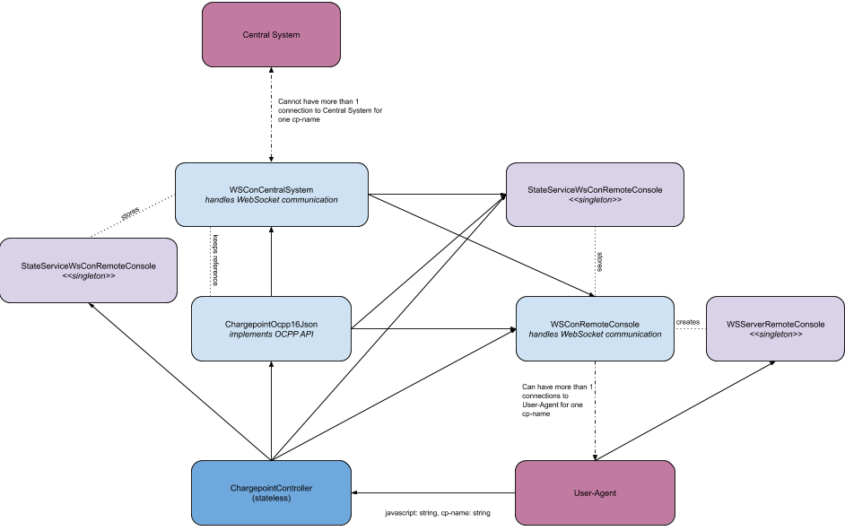

# Scriptable OCPP Chargepoint Simulator


# Intro

This simulator supports:

* OCPP 1.6 with JSON
* REST API with HTML Frontend
* File based batch mode
* Fully scriptable in JavaScript
* ftp operations

Key development considerations:

* This tool should help you in learning and understanding the [Open Charge Point Protocol (OCPP)](https://www.openchargealliance.org), therefore it doesn't hide any details, but make them easier to grasp
* It's an all [ECMAScript](https://en.wikipedia.org/wiki/ECMAScript) based project
* [NodeJs](https://nodejs.org) based server with server-side [TypeScript](https://www.typescriptlang.org) support
* [Vue](https://vuejs.org) + [Vuex](https://vuex.vuejs.org) + [bulma](https://bulma.io) + [axios](https://github.com/axios/axios) + [vue-axios](https://github.com/imcvampire/vue-axios) based HTML client with super simple [requirejs](https://requirejs.org/) no-transpiler setup 
* TODO: OCPP code should run inside a browser too

# license

This software is licensed under [Apache License, Version 2.0](https://www.apache.org/licenses/LICENSE-2.0). See [LICENSE](LICENSE).

## install & build

Make sure you've node installed (macOS: `brew install node`).

```
# install dependencies
npm i
# transpile TypeScript into ECMAScript
npm run build
```

## batch operation

Put the logic using JavaScript into a file (e.g. custom.js). Your file needs to export an async function with one
parameter. This parameter will pass the `connect(url: string): Chargepoint` function to obtain a Chargepoint class object.

Example:

```
let cp;
try {
  // WebSocket Connect (no OCPP)
  cp = await connect('ws://localhost:8100/xyz');
  // typical startup OCPP
  await cp.sendBootnotification({chargePointVendor: "vendor", chargePointModel: "1"});
  await cp.sendHeartbeat();
  await cp.sendStatusNotification({connectorId: 0, errorCode: "NoError", status: "Available"});
  await cp.sendStatusNotification({connectorId: 1, errorCode: "NoError", status: "Available"});
  // register code for GetDiagnostics, UpdateFirmware, Reset, ...
  cp.answerGetDiagnostics( async (request) => {
    const fileName = "foo." + new Date().toISOString() + ".txt";
    cp.sendResponse(request.uniqueId, {fileName});
    await cp.sendDiagnosticsStatusNotification({status: "Idle"});
    await cp.sleep(5000);
    await cp.sendDiagnosticsStatusNotification({status: "Uploading"});
    await cp.ftpUploadDummyFile(request.payload.location, fileName);
    await cp.sendDiagnosticsStatusNotification({status: "Uploaded"});
  });
  // Typical charging session
  await cp.sendAuthorize({idTag: "ccc"});
  await cp.sendStatusNotification({connectorId: 1, errorCode: "NoError", status: "Preparing"});
  cp.transaction = await cp.startTransaction({connectorId: 1, idTag: "ccc", meterStart: 1377, timestamp: "2020-06-11T10:50:58.333Z"});
  await cp.sendStatusNotification({connectorId: 1, errorCode: "NoError", status: "Charging"});
  await cp.meterValues({connectorId: 1, transactionId: cp.transaction.transactionId, meterValue: [{ timestamp: "2020-06-11T10:50:58.765Z", sampledValue: [{value: 1387}] }]});
  await cp.stopTransaction({transactionId: cp.transaction.transactionId, meterStop: 1399, timestamp: "2020-06-11T10:50:59.148Z"});
  await cp.sendStatusNotification({connectorId: 1, errorCode: "NoError", status: "Finishing"});
  await cp.sendStatusNotification({connectorId: 1, errorCode: "NoError", status: "Available"});
} catch (err) {
  console.log(err);
} finally {
  cp.close();
}
```

Start it:

```
./start.sh --v ./custom.js
# or
cat custom.js | ./start.sh --v --stdin
```

## server operation

Default port for HTML is 3000. Change via env variable `PORT`. The WebSocket based Server to Client communication is using `PORT+1`.

```
./start.sh --v
```

Open http://localhost:3000/?cp=$chargePointName where chargePointName defines the ID of your chargepoint.


## Create API docs

```
npm build && npm run docs
```

Open the docs in ./public/docs or access them via `./start.sh` and [http://localhost:3000/docs](http://localhost:3000/docs)

## TLS options

Start the server with a root CA file, a client cert and a client key:

* SSL_CLIENT_KEY_FILE = client certificate key file
* SSL_CLIENT_CERT_FILE = client certificate cert file
* SSL_CERT_FILE = server certificate root CA file

```
SSL_CLIENT_KEY_FILE=path/to/key.pem \
SSL_CLIENT_CERT_FILE=path/to/cert.pem \
SSL_CERT_FILE=path/to/ca_root.pem \
DEBUG='ocpp-chargepoint-simulator:simulator:*' \
nodemon --use-openssl-ca build/src/main.js
```

## server operation - DEV mode

Run those 2 in parallel:

```
npm run build:watch
./start.sh --v1 --d
```

## OCPP Operations

### Trigger Message

The simulator will respond to all `Trigger Message` with `status=NotImplemented` if no `answerTriggerMessage` have been
registered for this `requestedMessage`.

OCPP 1.6 defines those requestedMessage:
* "BootNotification",
* "DiagnosticsStatusNotification",
* "FirmwareStatusNotification",
* "Heartbeat",
* "MeterValues",
* "StatusNotification"

Example for BootNotification

```
cp.answerTriggerMessage("BootNotification", async (request) => {
    cp.sendResponse(request.uniqueId, {status: "Accepted"});
    cp.sendBootnotification({chargePointVendor: "vendor", chargePointModel: "1"});
});
```

Another example for DiagnosticsStatusNotification

```
// your code for handling GetDiagnostics will need to update a variable
// currentDiagnosticsStatus with the current state
cp.answerTriggerMessage("DiagnosticsStatusNotification", async (request) => {
    if(currentDiagnosticsStatus) {
        cp.sendResponse(request.uniqueId, {status: "Accepted"});
        cp.sendDiagnosticsStatusNotification({status: currentDiagnosticsStatus});
    } else {
        cp.sendResponse(request.uniqueId, {status: "Rejected"});
    }
});
``` 
 

### Supported

* BootNotification
* HeartBeat
* StatusNotification
* Authorize
* StartTransaction
* StopTransaction
* MeterValues
* Get Diagnostics
* Diagnostics Status Notification
* Update Firmware
* Firmware Status Notification
* Trigger Message
* Reset
* Get Configuration
* Change Configuration
* Change Availability

### Not supported (yet)

* Cancel Reservation
* Clear Cache
* Clear Charging Profile
* Data Transfer
* Get Composite Schedule
* Get Local List Version
* Remote Start Transaction
* Remote Stop Transaction
* Reserve Now
* Send Local List
* Set Charging Profile
* Unlock Connector

### Architecture


